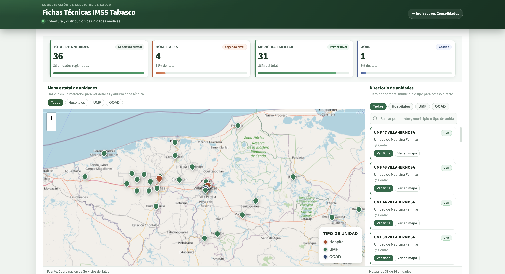
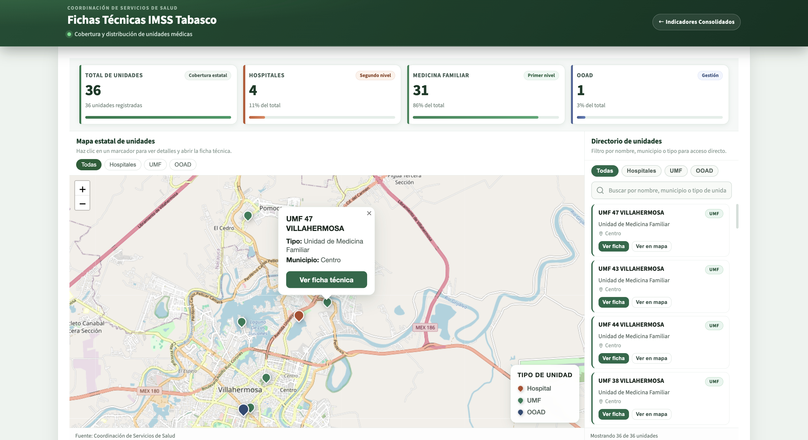
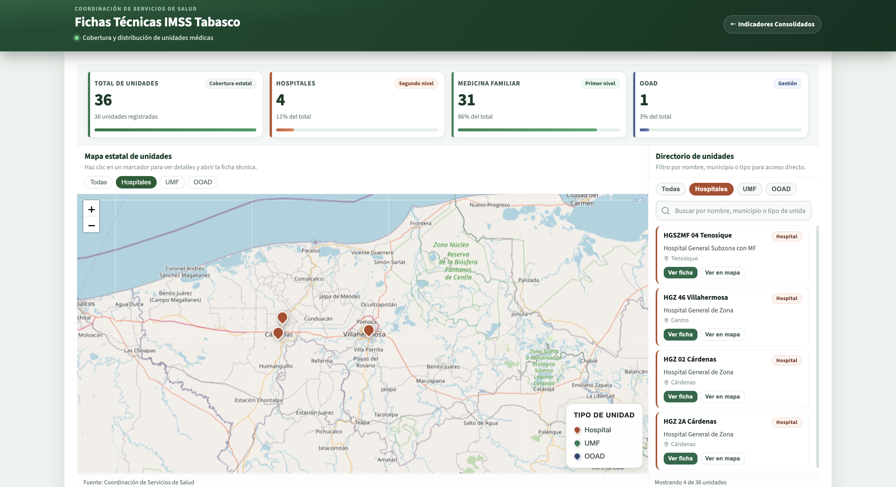
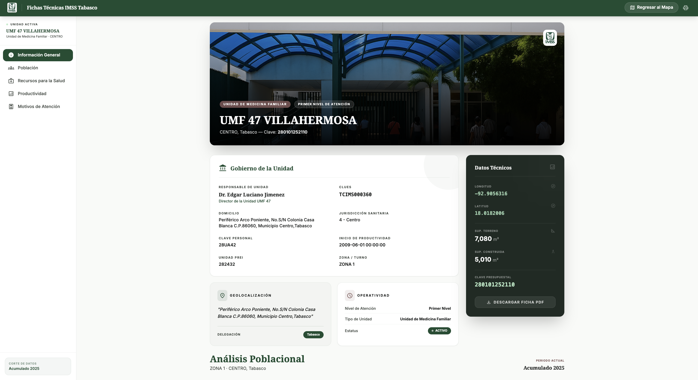
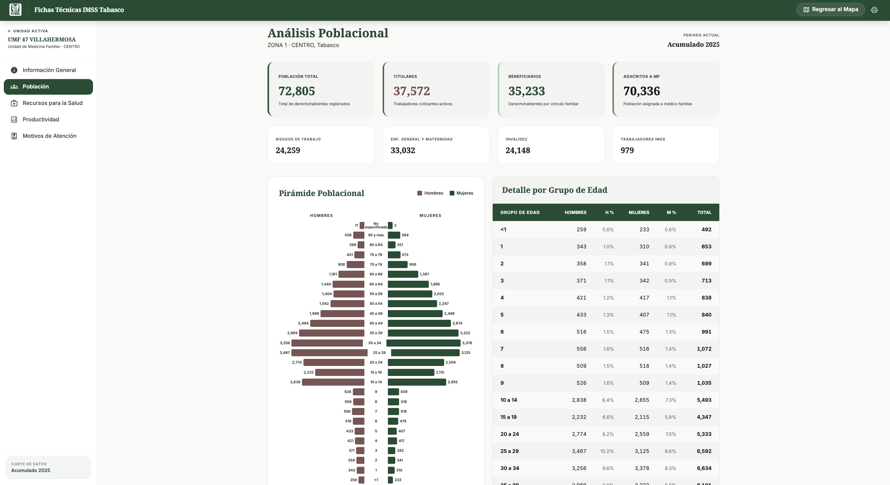
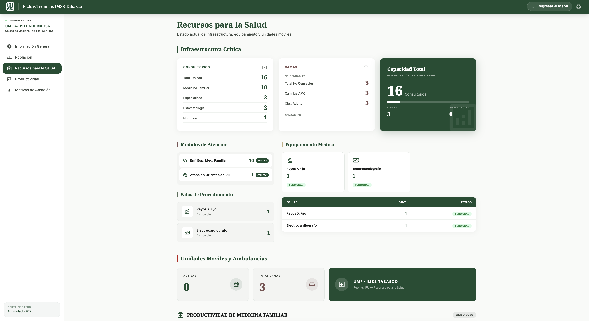
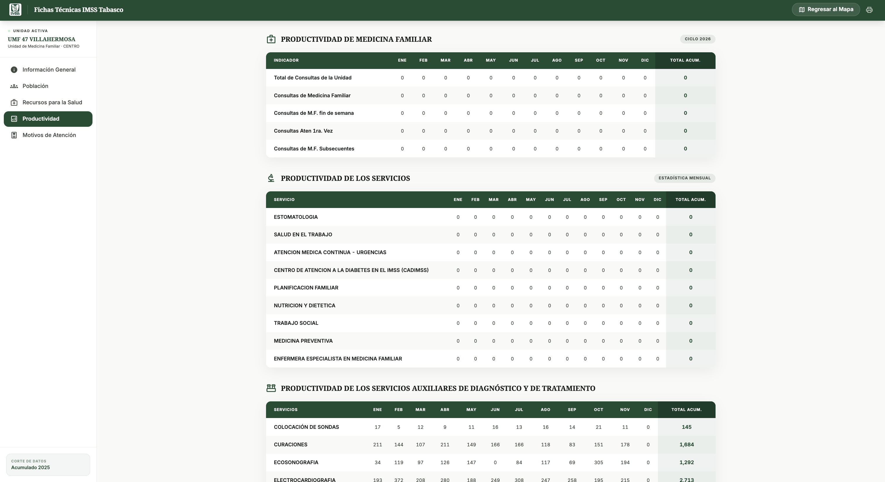
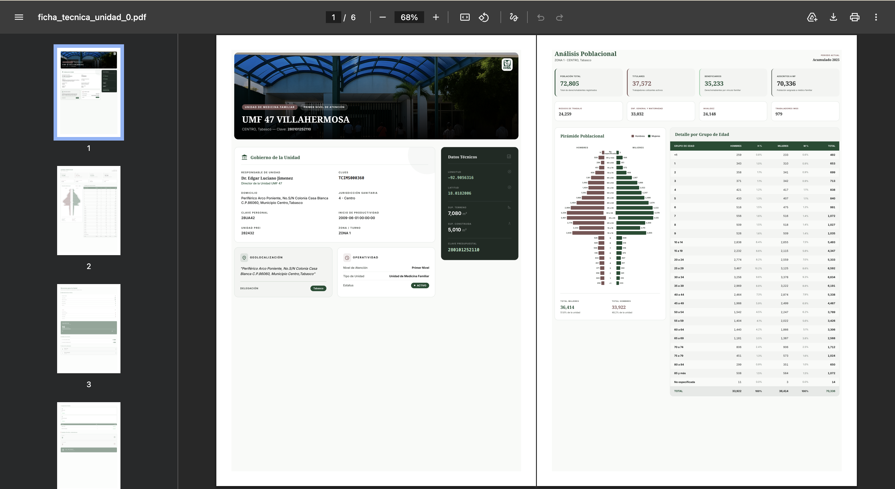

# Ficha Tecnica de Unidades de Salud - Demo de Portafolio

Aplicacion web y pipeline ETL para generar fichas tecnicas por unidad medica, con mapa interactivo, vista detallada y exportacion PDF.

Este repositorio esta preparado para portafolio publico con dataset demo anonimizado.

Aplicacion para visualizar unidades medicas, consultar ficha tecnica y exportar PDF a partir de datos procesados por ETL.

## Aviso de demo

Todo el contenido visible en este repositorio es de demostracion:

- La informacion mostrada en capturas, JSON y vistas del sistema es ficticia o anonimizada.
- No se incluyen datos operativos reales ni credenciales de entornos productivos.
- El objetivo es mostrar arquitectura, implementacion ETL y experiencia de producto para fines de portafolio.

## Stack

- Frontend: PHP, HTML, CSS, JavaScript (Leaflet)
- ETL: Python (pandas, openpyxl, pymssql, pymysql)
- Exportacion PDF: Node.js + Playwright

## Estructura

- `app/public/`: entrada web (`index.php`, `ficha_tec.php`)
- `app/public/api/export_ficha_pdf.php`: endpoint de exportacion PDF
- `app/assets/`: estilos, scripts e imagenes
- `scripts/etl/`: procesos ETL
- `scripts/run_pipeline.py`: pipeline secuencial
- `data/output/`: salidas JSON demo para ejecucion local
- `docs/README.md`: documentacion operativa detallada

## Ejecucion local

1. Instalar dependencias Python:

```bash
python3 -m venv .venv
source .venv/bin/activate
pip install -r requirements.txt
```

2. Instalar dependencias Node para exportacion PDF:

```bash
npm install
npm run pdf:install
```

3. Levantar con Docker (PHP Apache) y abrir:

```bash
docker run --rm -p 8080:80 -v "$(pwd)":/var/www/html php:8.2-apache
```

- `http://localhost:8080/app/public/index.php`

## Variables de entorno

Crear un archivo `.env` basado en `.env.example` para ejecutar ETL con conexiones reales:

- `FT_SIAIS_DB_USER`
- `FT_SIAIS_DB_PASSWORD`
- `FT_SIAIS_DB_NAME`
- `FT_SIAIS_DB_PORT`
- `FT_LOCAL_DB_HOST`
- `FT_LOCAL_DB_PORT`
- `FT_LOCAL_DB_USER`
- `FT_LOCAL_DB_PASSWORD`
- `FT_LOCAL_DB_NAME`

## Privacidad y datos

- Este repositorio no incluye credenciales reales.
- `data/input/` se considera informacion local/sensible y no debe publicarse.
- Los JSON en `data/output/` son de demostracion y no representan datos operativos reales.

## Capturas del proyecto

### Inicio





### Ficha tecnica






### Exportacion PDF



## Pipeline ETL

```bash
python scripts/run_pipeline.py
```

Opciones:

- `python scripts/run_pipeline.py --skip-siais`
- `python scripts/run_pipeline.py --with-tableau`
